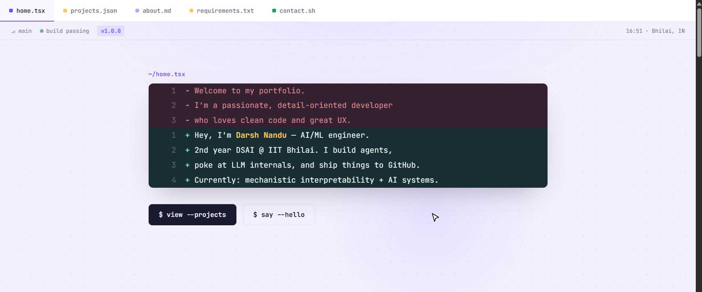
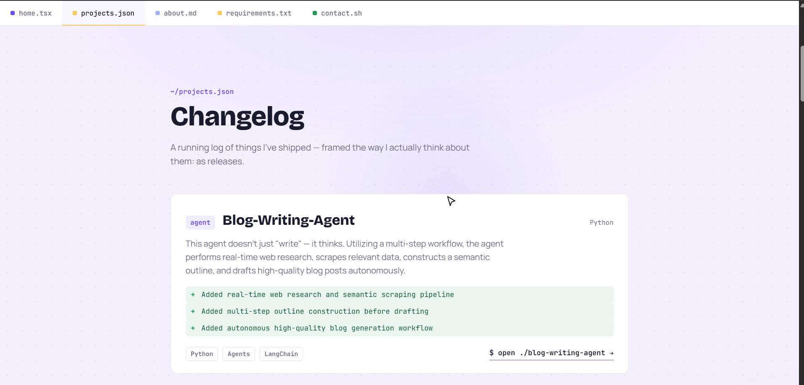
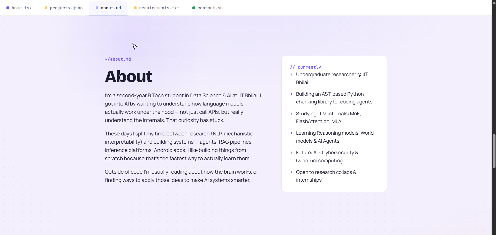
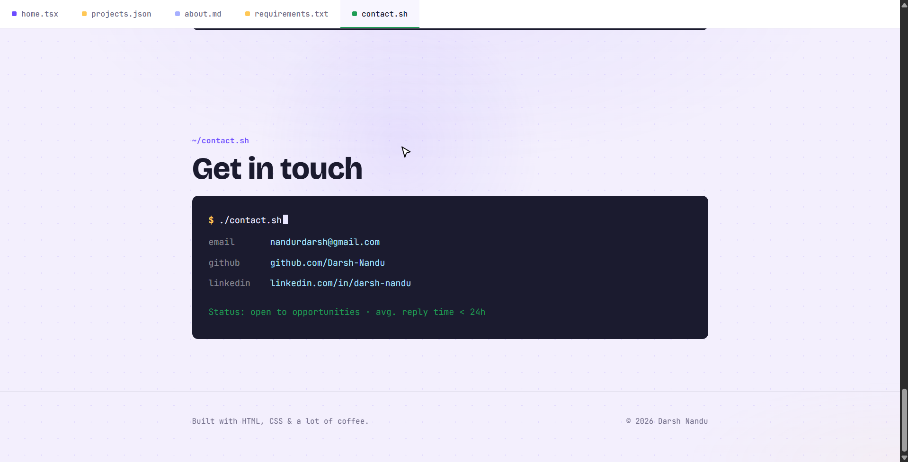

# 🧠 Darsh Nandu - Portfolio

> Personal portfolio of Darsh Nandu - 2nd year DSAI student at IIT Bhilai, AI/ML engineer, and undergraduate researcher.

**Live site → [darsh-nandu.github.io](https://darsh-nandu.github.io)**

---

## Preview

### Hero


### Projects


### About & Stack


### Contact


---

## Features

- **Diff-style hero** - introduction framed as a git diff
- **Changelog projects** - each project presented as a software release
- **Animated boot screen** - terminal boot sequence on load
- **Live clock** - real-time clock in the status bar
- **Scroll reveal** - elements animate in as you scroll
- **Terminal contact** - animated typewriter effect in the contact section
- **Custom cursor** - minimal white arrow with black outline
- **Dot-grid background** - subtle texture with ambient mouse glow
- **Sticky tab bar** - scrollspy navigation across all sections
- **Zero dependencies** - pure HTML, CSS, and vanilla JS. No frameworks, no bundler.

---

## Tech Stack

| Layer | Details |
|---|---|
| Markup | Semantic HTML5 |
| Styling | CSS custom properties, no preprocessor |
| Scripting | Vanilla JS (ES5-compatible) |
| Fonts | Google Fonts - Bricolage Grotesque, Manrope, JetBrains Mono |
| Hosting | GitHub Pages |
| CI/CD | GitHub Actions |

---

## Local Development

No build step required - just open the file:

```bash
git clone https://github.com/Darsh-Nandu/Darsh-Nandu.github.io
cd Darsh-Nandu.github.io
open index.html   # macOS
# or
xdg-open index.html  # Linux
```

Or serve it locally with Python:

```bash
python -m http.server 3000
# then visit http://localhost:3000
```

---

## Deployment

This site auto-deploys to GitHub Pages via the included GitHub Actions workflow whenever you push to `main`.

**First-time setup:**
1. Go to your repo → **Settings → Pages**
2. Under **Source**, select **GitHub Actions**
3. Push to `main` - the workflow handles the rest

The live URL will be: `https://<your-username>.github.io`

---

## Project Structure

```
.
├── index.html              # Entire site - single file
├── screenshots/            # README preview images
│   ├── hero.png
│   ├── projects.png
│   ├── about.png
│   └── contact.png
├── .github/
│   └── workflows/
│       └── deploy.yml      # GitHub Actions CI/CD
└── README.md
```

---

## License

MIT - feel free to use this as a template. A credit or star is appreciated but not required.

---

*Built with HTML, CSS & curiosity.*
